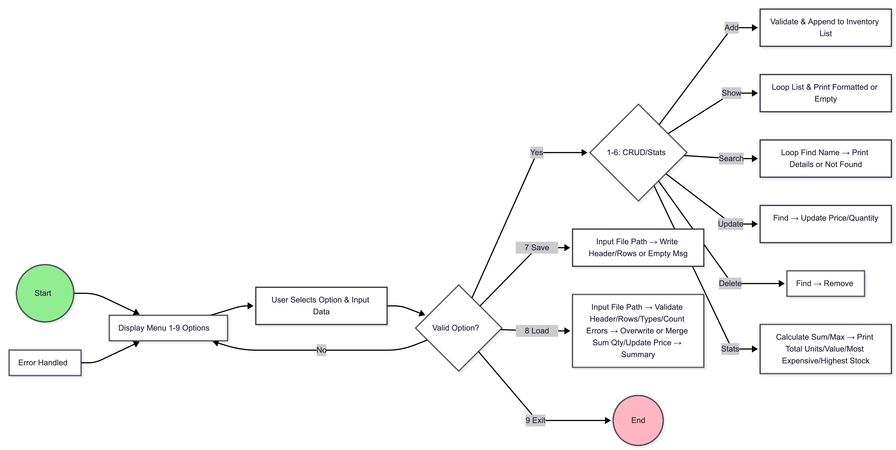

# Inventory System 

## System Functionality
Command-line inventory management for small business/product owners:
- **Add/Search/Update/Delete** products (name, price, quantity).
- **View inventory** formatted list.
- **Advanced Stats**: Total units/value, most expensive item, highest stock.
- **CSV Persistence**: Save/load data, validate imports, merge/overwrite with error handling.


## Requirements
- **Python 3.8+** (stdlib only: csv, lambda).
- macOS/Linux/Windows compatible.

## Installation
1. **Clone/Download from GitHub**:
   ```
   git clone https://github.com/[your-username]/innventory.git
   cd innventory
   ```
   Or download ZIP from GitHub repo → extract.

2. **Run**:
   ```
   PYTHONPATH=src python3 src/main.py
   ```
   (Sets module path for imports.)

## Structure
```
src/
├── main.py      # Entry + menu loop
├── menu.py      # English 1-9 options
├── services.py  # CRUD/Stats/choose
├── archivos.py  # CSV save/load
├── validation.py # Option/input validation
├── inventory.py # Recursive validator
```

## Usage
**Menu Options** (English UI):
1. Add product
2. Show inventory
3. Search product
4. Update product
5. Delete product
6. Statistics
7. Save CSV (e.g. `inventory.csv`)
8. Load CSV (validate + Overwrite/Merge)
9. Exit

Example:
- Add \"Laptop\" $1000 qty 5 → Show → Stats → Save → Restart → Load → Stats verify.

## Product Owner Flowchart


## Acceptance Criteria
- ✅ Full CRUD/Stats persistent
- ✅ Modular, # comments
- ✅ CSV 


